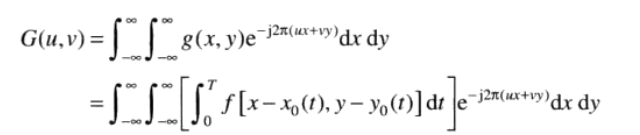
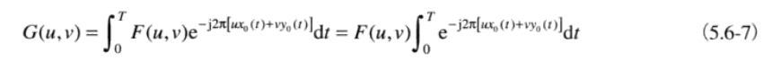

### 2.4.2
笛卡儿积 A= {a,b} B = {0,1,2} AxB = {(a,0), (a,1), (a,2), (b,0), (b,1), (b,2)}

令Z和R分别表示整数集和实数集。取样处理可以看成吧xy平面分成一个网格的过程，网格中每个单元的中心坐标是笛卡儿积ZxZ中的一堆元素，ZxZ是所有有序元素对(zi,zj)的集合，zi，zj是Z中的整数

因此如果（x,y）是ZXZ种的整数，且f是把灰度值赋给每个特定坐标对(x,y)的一个函数，则f(x,y)就是一幅数字图像。

显然这种赋值过程就是一个量化处理的过程。灰度值是整数，则用Z代替R，然后数字图像变成一个二维函数，且他的坐标和幅值都是整数。

假设离散灰度级数L = 2^k 是等间隔的，且他们是区间[0,L-1] 内的整数。有时，由灰度跨越的值域称为 动态范围。我们将图像系统的动态范围定义为系统中最大可度量灰度与最小可检测灰度之比。

动态范围上限取决于饱和度，下线取决于噪声。定义一幅图像最高和最低灰度差为对比度。饱和度是值超过这个值的灰度级将被剪掉这样的一个最高值。

### 2.4.3
空间分辨率 是图像中可辨别最小细节的度量 有多种方法说明        没毫米线数对

    每单位距离先 对数 和每单位距离 点数（像素数）    
    每英寸点数：dpi （一般用N表示）

尺寸本身只是在图像容量间作比较才有帮助。？

如果没有规定图像包含的空间维数，那么我们说一幅图像的分辨率为1024x1024像素是没有意义的。

灰度分辨率  是指在灰度级中可分辨的最小变化。

通常说一幅背量化为256级的图像有 8比特（一般用k表示） 的回复分辨率

注：k值的减小带来对比度的增加，可能在人的主观印象上对图片的感觉越好

### 2.4.4   图像内插

内插是在诸如放大，收缩，旋转和几何校正等任务中广泛应用的工具。
近临内插法，把原图像中近邻的灰度，赋值给了每个新位置。  --边缘失真

750x750网格大小收缩到500x500图像一样大，然后网格中的数据取图像中最接近的像素

双线性内插：v(x,y) = ax + by + cxy + d

三次内插 v(x,y) = ∑i1~3 ∑j1~3 (aij * x^i * y^j)

## 2.5 像素间的基本关系
### 2.5.1相邻性
    p(x, y)的四领域 N4(p) 八领域N8(p)

### 2.5.2邻接性，连通性，区域和边界
令v是用于定义邻接性的灰度值合集。则V可能是灰度值（0~255）集合的任何一个子集

     a)4邻接。如果q在集合N4(p)中，则具有V中数值的两个像素p和q是4邻接的。

     b)8邻接。如果q在集合N8(p)中，则具有V中数值的两个像素p和q是8邻接的。

     c)m邻接。如果i)q在N4(p)中，或ii)q在Nd(p)中，且集合N4(p)且N4(q)为空，则具有V中数值的两个像素p和q是m邻接的。
---
### 2.5.3 距离度量
欧几里得 欧式 距离 即直线距离De(p,q)

距离D4(城市街区距离) D4(p,q) = |x-s| + |y-t|    //D4 = 1的像素是（x,y）的四领域

距离D8（棋盘距离） D8 = max(|x-s| ， |y-t|)  D8 = 1的像素是（x,y）的9领域

## 2.6 数字图像处理中用到的数学工具
### 2.6.1阵列/矩阵

阵列相乘 对应位置相乘

矩阵相乘 。。。
### 2.6.2线性操作和 非线性操作
图像处理方法最重要的分类之一是它是线性还是非线性的。

算子定义：对于给定的输入图像 H[f(x,y)] = g(x,y)

 如果H[aifi(x,y) + ajfj(x,y)] = aiH[fi(x,y)] + ajH(fj(x,y)) = aigi(x,y) + ajgj(x,y)

则称H是一个线性算子。（两个等式分别称为 加性，同质性）否则为非线性算子。（比如池化pooling）

线性处理以大量的可用于图像处理的理论实践结果为基础。

非线性应用受到更多限制，但是有些性能会远优于线性操作的非线性图像处理。

## 2.6.3算术操作
噪声处理:（机械噪声）

增强差别:比如碘介质血管X射线造影

图像相乘/除：阴影矫正

### 2.6.4 集合的逻辑操作

#### 基本集合操作
并集，交集，互斥集，差集，

#### 逻辑操作
处理二值图像时，OR/AND和NOT XORT就是普通的并交和求补 异或操作。逻辑一词来自于逻辑理论，在逻辑理论中，1表示真，0表示假

#### 模糊集合
允许用概率来代替0/1的事件

### 2.6.5 空间操作

#### 单像素
以灰度为基础，对单个像素做映射变换
### 邻域

其中Sxy是大小为mxn，中心在(x,y)的矩形领域中像素的平均值 //可以用来打马赛克么。。。
#### 几何空间变换的图像配准

几何变换改进图像中像素间的空间关系，常称为 橡皮膜变换。

由两个基本操作组成 

i）坐标的空间变换
(x,y) = T{(v,w)}    例如 (x,y) = T{(v,w)} = (v/2, w/2) 在两个方向上把原图缩小一半

仿射变换：

根据矩阵T中的值，对一组坐标点做尺度/旋转/平移或偏移
 

实际上，我们可以按照两种基本方法来使用仿射变换公式。
向前映射: 扫描输入图像的像素，并在每个位置(v,w)直接计算输出图像中相应像素的空间位置(x,y)构成

反向映射:扫描输出像素的位置，并在每一个位置(x,y)使用(v,w) = T^-1 (x,y) 这样更高效

图像配准：解决图像畸变问题，比如卫星图像照的地球是个球面

有多种模型解决此类问题，最简单的模型比如双线性近似
    
    x = c1 v + c2 w + c3vw + c4
    
    y = c5 v + c6 w + c7vw + c8

四个约束点即可计算c1~c8间的关系。组成一个个四边形。 

一般采用多个四边形覆盖一幅图像，以覆盖不同区域的不同畸变程度。

比如二维码扫描的初步处理

### 2.6.6 向量与矩阵

像素向量z 和一个任意点a 在n维空间的欧式距离D可以用一个向量积来定义：

向量范数，表示为 ||z - a||

像素向量的另一个重要优点是由下式表示的线性变换

    w = A(z - a)        //A是mxn的矩阵 z和a是 nx1大小的列向量。 

### 2.6.7 图像变换

二维线性变换 

其中f(x,y) 是输入图像 r(x,y,u,v)正变换核，

### 2.6.8 概率方法
 
xxx只是一些介绍性文字和举例

# 3 灰度变换与空间滤波

## 3.1 背景知识
### 3.1.1 灰度变换和空间滤波基础

空间域技术直接在图像像素上操作。对于频率域来说，其操作在图像的傅里叶变换上执行，而不针对图像本身。

空间滤波：对图像序列进行逐像素的扫描
领域与预定义的操作 一起被称为 空间滤波器 （或 空间掩膜，核，窗口或模板）
在领域中执行的操作类型决定了滤波处理的特性。

### 3.1.2 关于本章中的例子
多是图像增强应用。对图像加工，使其结果对于**特定**的应用比原始图像更适合的一种处理。（意味着增强技术是面对问题的。）

### 3.2 一些基本的灰度变换函数
#### 3.2.1 图像反转
图像灰度变化 s = L -1 -r    (比如X光分离)

其中s是目标灰度，[0,L-1]是灰度级数范围 r是源的灰度

#### 3.2.2 对数变换
通用形式为 s = c log(1 + r)

其中c是一个常数。该变换将输入中范围较窄的地灰度值映射为输出中较宽范围的灰度值，相反地，对搞得输入灰度值也是如此。我们使用这种类型的变换来扩展图像中暗像素的值。

#### 3.2.3 伽马变换 （幂律变换）
通用形式 s = c r^y 

其中c 和y均为正常数

#### 3.2.4 分段线性变换函数
优点是分段线性函数的形式可以是任意复杂的。

缺点是技术说明明确要求用户输入

##### 对比度拉伸

##### 比特平面分层
把一幅图像分解为比特平面，对于分析图像中每个比特的相对重要性是很有用,这一处理可帮助我们确定用于该图像的比特数的充分性。此外这种类型的分解对图像压缩也很有作用，在图像压缩中，重建一幅图像时，所用的平面要比全部平面少。

### 3.3 直方图处理

最简单有效的工具之一。
#### 3.3.1 直方图均衡
目标灰度 ps(s) = 1 / (L - 1)

 MN是图像中像素个数 nk是图像中灰度为rk的像素个数

推导过程就先布列出来了，有兴趣翻书看。比较简单

输出图像通过公式3.3-8 将输入图像中灰度级为rk的各像素映射到输出图像中灰度级为sk的对应像素得到。在这个公式中，变换T(rk)称为直方图均衡或 直方图线性变换。
 
一幅图的直方图与原图灰度值映射公式，直接由密度公式求得。

直方图处理会离散渐进的边缘，出现伪轮廓

#### 3.3.2 直方图匹配 （规定化）
处理后的图像有预先规定的直方图形状。

即根据给定源图像的灰度密度函数PDF和生成图像的灰度密度函数PDF。计算变换过程

比如 原图像 pr(r) = 2r/(L -1)^2 生成图像pz(z)=3z^2/(L-1)^3

首先[0,L-1]寻找直方图均衡变换:

输入灰度值的平方 除以 (L-1)^2 将产生一幅灰度为s并具有均匀PDF的图像，因为这是早些时候讨论的直方图均衡变换。但我们感兴趣的是具有规定直方图的图像，因此，在[0,L-1]区间寻找下一个直方图均衡变换:

最后求G(z) = s,但 G(z) = z^3 / (L -1)^2连立等式得

z= [(L-1)^2 * s]^1/3 又s = r^2 /(L - 1)

则 z = [(L-1)r^2]^1/3 是目标转换函数

总结：其实这里是一个正过程加一个逆过程的叠加，如果把源图像和目标图像都映射到同一个均衡直方图中，令这个均衡直方图是 z 则 T(r) = T'(z) = 常数 MN / (L - 1)

则z = T'^-1(T(r))

实例：略

直方图均衡和直方图匹配的比较:直方图匹配可以差异化放大图片中特定灰度范围的对比度，以改善图像质量

### 3.4 空间滤波基础

#### 3.4.1 空间滤波机理
在一个领域执行，对该领域包围的图像像素执行的预定义操作组成

#### 3.4.2空间相关与卷积

在执行线性空间滤波时候，对该领域包围的图像像素执行预定义操作。滤波产生一个新像素，新像素的坐标等于领域中心的坐标，像素的值是滤波操作的结果。

#### 3.4.2空间相关与卷积

两个相近的盖帘一个是相关，一个是卷积。

相关是滤波器模板移过图像并计算每个位置成绩之和的处理。卷积的机理相似，但滤波器首先要旋转180°。

旋转，指的是多维方向旋转。

卷积的数学表示:

-s -t表示翻转180，如果是相关即+s +t五角星为空心五角星

图像处理文献中，可能会遇到卷积滤波器，卷积模板，卷积核这些术语。按惯例，这些术语用来表示一种空间滤波器，并且滤波器未必用于真正的卷积。类似地，模板与图像的卷积通常用于我们刚刚讨论的滑动乘积求和处理，而不必区分相关与卷积间的差别。

#### 3.4.3 线性滤波的向量表示

R = wTz (wT滤波器的倒置 z 由滤波器覆盖的相应图像灰度值)

#### 3.4.5 空间滤波器模板的产生
高斯模糊是一种图像模糊滤波器，它用正太分布计算图像中每个像素的变。N维空间正太分布方程为

这样进行模糊处理比其他的均衡模糊滤波器更高的保留了边缘效果。

理论上讲，图像中每个像素的分布都不为0，也就是说每个像素的计算都要包含整幅图像。在实际应用中，计算高斯函数的离散近似时，大概3σ距离之外的像素可以认为不起作用，这些像素的计算就可以忽略。通常，图像只需要处理(6σ +1) x (6σ +1)的矩阵就可以保证相关像素影响。

除了圆形对称之外，高斯模糊也可以在二维图像上对两个独立的一维空间分别进行计算，这叫作线性可分。这也就是说，使用二维矩阵变换得到的效果也可以通过在水平方向进行一维高斯矩阵变换加上竖直方向的一维高斯矩阵变换得到。从计算的角度来看，这是一项有用的特性，因为这样只需要

对一幅图像进行多次连续高斯模糊的效果与一次更大的高斯模糊可以产生同样的效果，大的高斯模糊的半径是所用多个高斯模糊半径平方和的平方根。例如，使用半径分别为 6 和 8 的两次高斯模糊变换得到的效果等同于一次半径为 10 的高斯模糊效果， 。根据这个关系，使用多个连续较小的高斯模糊处理不会比单个高斯较大处理时间要少。

### 3.5 平滑空间滤波器
#### 3.5.1 平滑空间滤波
降低图像灰度的的输出是包含在滤波器模板领域内的像素简单平均值。
也称为均值滤波器。常用目的就是降低噪声。

加权的均值滤波器

平滑滤波器模板，其中数字是权值

#### 3.5.2 统计排序滤波器（非线性）
这种滤波器的响应以滤波器包围的图像区域中，所包含的像素排序为基础，使用统计排序结果决定替代中心像素的值。比如中值滤波器，将像素领域内灰度的中值代替该像素的值。它提供了一种优秀的去噪能力，而且比相同尺寸的线性平滑滤波器的模糊层度明显要低。它对付椒盐噪声非常有效。

### 3.6 锐化空间滤波器

主要目的是突出灰度的过度部分，图像锐化的用途
#### 3.6.1 基础
对于一维函数，其一阶微分的基本定义是差值

对于二阶微分，定义为如下差分

下图显示了一段扫描线，小方块中是扫描线中的灰度值

图中的零交叉对于边缘定位是十分重要的。

#### 3.6.2 使用二阶微分进行图像锐化 --- 拉普拉斯算子

各向同性滤波器是旋转不变的，即将原图像旋转后进行滤波处理给出的结果与原图像滤波再旋转的结果相同。

一个二维图像函数f(x,y)的拉普拉斯算子定义为：

实际使用的基本表达式即
g(x,y) = f(x,y) + c[▼²f(x,y)]

Ps：华为手机拍月亮可能就是用的这种滤波器

#### 3.6.3 非锐化掩蔽和高提升滤波

非锐化掩蔽的步骤：
1.掩蔽原图像
2.从原图像中减去模糊图像
3.将模板加载到源图像上

令f'(x,y) 表示模糊图像，模板：
g_mask(x,y) = f(x,y) - f'(x,y)
然后再原图像上加上改模板的一个权重部分:
g(x,y) = f(x,y) + k * g_mask(x,y)
当k > 1时，我们将该处理称为高提升滤波
k< 1 时，我们将该处理称为 非锐化掩膜

#### 3.6.4 使用一阶微分对（非线性）图像锐化------梯度
 

卷积模板

图中 d和e 的模板称为 soble算子，中心系数使用权重2的思想是通过突出中心点的作用而达到平滑的目的

常用于工业成像诊断产品缺陷使用，比如隐形眼镜边缘完损性检测。

### 3.7 混合空间增强法
多种方法叠加使用

###  3.8 使用模糊技术进行灰度变换和空间滤波

#### 3.8.1 引言

如2.6.4

#### 3.8.2 模糊集合论原理
模糊集合为处理不严密信息提供了一种形式

定义:令Z 为元素对象，z表示Z的一类元素 Z = {z}。 该集合Z称为论域

Z中的模糊集合 A由 隶属度函数 ua(z) 表征， 它是与Z的元素相关，取值在[0,1]内的一个实数。ua(z)在z处的值表示A中z的隶属度等级。最接近ua(z)的值与在A中的z的较高的隶属度等级趋于一致，而当ua(z)接近于0时，则相反。

因此对于ua(z) = 1的成员z，是集合的完全成员

对于ua(z) = 0的成员z，都不是集合的成员。

当ua(z)的取值 介于 0~1之间，z则是集合Z的部分成员。

模糊集合的表示：定义模糊集合 A = {z, ua(z) | z 属于 Z}

集合关系的扩展

    空集:当且仅当Z中的隶属度函数为0，模糊集合为空集

    相等:当且仅当对于所有的z属于Z，由 ua(z) = ub(z)，两个模糊集合A。B相等

    补集:NOT(A) = B表示模糊集合A 的补集，定义为其隶属度函数 ub(z) = 1 - ua(z)

    子集:当且仅当对于所有的 z属于Z，由 ua(z) <= ub(z) 模糊集合A是 B的子集

    并集:对于所有z属于Z，两个模糊集合AB并集 Uu(z) = max[ua(z), ub(z)]

    交集:对于所有z属于Z，两个模糊集合AB并集 Uu(z) = min[ua(z), ub(z)]

以下给出了常用隶属度函数的形式和图形

 

 

#### 3.8.3 模糊集合的应用

#### 3.8.4 使用模糊集合进行灰度变换

比如在做对比度增强时，使用模糊合集定义三种模糊项

IF 像素 暗 THEN 输出 暗

IF 像素 灰 THEN 输出 灰

IF 像素 亮 THEN 输出 亮

则具有如下公式表述
 

基于如上规则的对比度增强相关度图形
 

#### 3.8.5 使用模糊集合进行空间滤波

比如4领域下：

IF d2 =0 AND d6=0 THEN z5 = 0

IF d2 =0 AND d6=0 THEN z5 = 0

IF d2 =0 AND d6=0 THEN z5 = 0

IF d2 =0 AND d6=0 THEN z5 = 0

ELSE z5 = 1

这样，如果a5是噪点的化就会被消除，如果是边界的话，就会被保留 （0白色模糊集 1 黑色模糊集）

其中隶属函数图如下:

 

## 第四章 频率与域滤波

### 引言

前一章主要解决锐化和模糊问题，但如果不了解在图像滤波中如何应用傅里叶变换和频率域的基本知识，想彻底了解这一个领域也是不太可能的。关键在于要关注基本原理和他们数字图像处理的关系。本章为傅里叶变换的基本原理打下一个基础，并介绍基本图像滤波中如何使用傅里叶变换。

并且接触几个重要的取样问题，例如混淆，这些处理要求对频率域滤波的理解。

### 4.1 背景

#### 4.1.1 傅里叶级数和变换

### 4.2 基本概念

什么是图像变换：

1. 将图像看成式线性叠加系统
2. 图像在空域上有很强的想关性
3. 图像变换式讲图像从空域变换到其他域如频域的数学变换
4. 借助于正交变换的特性可使在空域上的复杂计算转换到频域之后得到简化
5. 借助频域特性的分析，将更有利于获得图像的各种特性和进行特殊处理

可进行图像变换的基本条件： 满足正交，完备两个条件的函数集合或矩阵才能用于图像的分析

常用几种变换有：傅里叶变换WALSH变换/哈达玛变换/Haar变换/SLANT变换/K-L变换/以及特定条件下的CONSINE变换/SINE变换等，都满足正交性和完备性的两个条件

#### 4.2.1 复数
定义 C = R + jI

共轭复数 C = R - jI

极坐标复数 C = |C| (cosθ + j sinθ)

根据欧拉公式 

 

 

可以给出极坐标系啊我们很熟悉的复数表示

 

#### 4.2.2 傅里叶级数

此处开新坑，详情见 如何理解傅里叶级数公式

https://www.matongxue.com/madocs/619.html

欧拉公式

https://www.matongxue.com/madocs/8.html

一维的离散傅里叶变换

设f(x) 是在**时域上N点离散序列**，x是**离散实变量**，u为离**散频率变量**，则离散傅里叶变换对定义为

 

其中4.8为正变换，4.9为反变换 正变换对应的exp[..]是正变换核心 exp[j2Πux/N]是反变换核

变换后F(u) 变成了 **频率域下的N点离散序列**

根据欧拉公式 exp[jx] = cos x + j sin x

exp(-j2Πxu) = cos2Πux - j sin2Πux

所以F(u)是一般复数，并可写为F(u) = R(u) + j I(u)

二维离散傅里叶变换 2D-DFT

设f(x,y)是在空间域上等间隔采样得到的MxN的二维离散信号，x和y是离散实变量，u和v是离散频率变量，则二维离散傅里叶变换一般定义为
 

 

*记住这个公式，其中的二维旋转因子 是由向量函数推导而来*

和一维一样，可将二维离散傅里叶变换的频谱和相位角定义为

|F(u,v)| = sqrt(R(u,v) ^2 + I(u,v) ^2)

φ(u,v) = arctan(I(u,v) / R(u,v))

将二维离散傅里叶变换的频谱平方定义为f(x,y)的功率谱，记为

P(u,v) = | F(u,v) |^2

离散傅里叶变换 是最经典的一种 正/余弦型正交变换，建立了空间域和频域间的关系，有明确的物理意义，能够更直观，方便的解决许多图像处理问题。

#### 4.2.3 冲激及其取样特征

线性系统和傅里叶变换研究核心是冲激及其取样特性。连续变量t在 t= 0处的单位冲激表示为θ

 

它被限制为满足等式

 

物理上，如果把t解释为事件，那么一个冲激可以看成幅度无限，持续时间为0，具有单位面积的尖峰信号。一个冲激具有关于如下积分的所谓取样特性

------------------------

看了一下其他地方的描述：

对于一个线性系统的输入和输出，期间必定存在关系

 

h(t)称为线性系统的单位冲激响应函数，其含义为： 当线性系统输入f(t)为单位脉冲函数时，线性系统的输出响应

上式称为卷积积分

#### 4.2.4 二维离散傅里叶变换的若干重要性质

1. 基图像

    当二维图像MxN 是个正方形 M = N时，

     

    将f(xy)所有的取值用二维图像显示出来，即得到一幅基图像

2. 可分离性
    将二维离散傅里叶变化公式写成如下的分离模式：

     

    上述的可分离表示形式说明，可以连续运用两次一维DFT来实现一个二维DFT
 
3. 平均值

    一幅图像的灰度平均值 f = 1/N * F(0, 0)

4. 周期性
    F(u, v) = F(u + mM, v + nN)

    MN就是图像的分辨率 

5. 共轭对称性

    F(u,v) = F*(-u, -v)
    
    |F(u,v)| = |F(-u, -v)|

6. 平移性
  
     

    给函数乘以一个指数项，就相当于把其变换后的傅里叶频谱在频率域进行平移。

    反之亦然

### 4.3 图像傅里叶变换的频谱分析

#### 4.3.1 图像傅里叶频谱关于(M /2 , N/2)的对称性

设f(x,y)是一幅大小为ＭＮ的图像，根据周期公式

 F(u, v) = F(u + mM, v + nN) 

 和共轭对称性

 |F(u,v)| = |F(-u, -v)|

可得  |F(u,v)| = |F(M-u, N-v)|

由此可得，频谱图像关于坐标(M /2 , N/2) 中心对称

#### 4.3.2 图像傅里叶频谱特性及其频谱图

#### 4.3.3 傅里叶变换在图像处理中的应用

### 4.4 离散余弦变换

#### 4.4.1 DCT

函数的 偶对称性使DCT只有实数域变换结果，不再涉及复数运算，运算简单，费时少

保持变换域的频率特性

与人类视觉系统特性相适应

#### 4.3.2 2D-DCT

基本思想  把一个NxN的图像数据矩阵延拓成二维平面上的偶对称阵列，延拓方式由两种

1. 围绕图像边缘（但不重叠）将其折叠成对称形式而得到的变换，称为偶离散余弦变换
2. 通过重叠图像的第一列像素和第N-1列像素将其折叠成对称形式而得到的变换称为奇离散余弦变换

下面讨论的只是偶离散余弦变换

。。。 证明过程

二维DCT的正反变换的空间矢量表示形式为

F = q f qTc

f = qT F q

变换核q 和其转置可以用矩阵相乘法来简化求余弦离散变换

 

#### 4.3.3
#### 4.3.4 

## 第五章 图像增强与复原

### 5.1 问题背景

改善图像视觉效果，使图像更适合人或及其进行分析处理

通过图像增强，可以减少图像中的噪声，提高目标与背景的对比度

强调或抑制图像中的细节

图像增强的评价标准

主观效果和实际突出了某些细节

处理的作用域：空间域 在二维平面上直接对像素值进行处理 和 频率域上做逆变换得到增强图像

空间域增强：只改变灰度值，不改变像素位置

幂次变换 s= c r^y 

### 5.2 退化复原模型

假设退化函数是一个线性位置不变的过程，那么空间域的退化公式：
 
g退化后图像 f输入图像 h退化函数 n加性噪声项
五角星运算符表示空间卷积

由4.6.6讨论可知，空间域中的卷积等于频率域的乘积，因此上式等价于频率域表示：
 

### 5.2
根据直方图来确定噪声来源。

 

周期噪声：在图像获取中从电力或机电干扰中产生的，唯一一种空间依赖性噪声

可以用傅里叶图谱中明显看到

### 5.3 只存在噪声的复原--空间滤波

当一幅图像中唯一存在的退化是噪声时有
g(x,y) = f(x,y) + n(x,y)
和
G(u,v) = F(u,v) + N(u,v

噪声是未知的，所以从g或者G中减去噪声不是一个现实的选择，只能选择空间滤波的方法。

#### 5.3.1 均值滤波器
##### 算术均值滤波

f = sum(g(s,t)) / (m*n)

取一个大小为mxn的空间滤波器来实现，虽然模糊了结果，但是降低了噪声

##### 几何均值滤波器

 

其中，每个复原的像素由字图像窗口中像素成绩的1/mn次幂给出。

几何均值滤波器实现的平滑效果可与算术均值滤波器相比，但这种处理中丢失的图像细节更少

##### 谐波均值滤波器

 

谐波均值滤波器对盐粒噪声效果较好，但不适用于胡椒噪声。善于处理高斯噪声等

##### 逆谐波均值噪声
 

其中Q为滤波器的阶数，这种滤波器适合减少或再实际中消除椒盐噪声的影响。当Q为正时，该滤波器消除胡椒噪声，当Q为负时，该滤波器消除盐粒噪声。但它不能同事消除这两种噪声。注意，当Q=0时，逆谐波均值滤波器简化为算术平均值滤波器。当Q=-1时，则为谐波滤波器

#### 5.3.1 统计排序滤波器

##### 中值滤波器
使用一个像素邻域中的灰度级中值来替代该像素的值

f=median(g(s,t))

它的应用非常普遍，可以提供良好的去噪能力，且比相同尺寸的线性平滑滤波器引起的模糊更少。再存在单极或双极脉冲噪声的情况下，中值滤波尤其有效。

##### 最大值和最小值滤波器

f=max(g(s,t))
f=min(g(s,t))
这种滤波器对图像中最亮/暗点非常有用，可以降低胡椒/盐粒噪声

##### 中点滤波器

简单计算滤波器包围区域中最大值和最小值的重点

 
f=(max(g(s,t))) + min(g(s,t))))/2

对于随机分布噪声工作的最好，如高斯噪声和均匀噪声

##### 修正的阿尔法均值滤波器

 

假设再领域S内去掉g(s,t)最低灰度值的d/2和最高灰度值的d/2。令gr(s,t)代表剩下的mn-d个像素。由这些剩余像素的平均值形成的滤波器。

d的范围可以为0到mn-1。再包括多种噪声的情况下很有用，例如高斯噪声和椒盐噪声混合的情况

#### 5.3.3 自适应滤波器

##### 自适应局部降低噪声滤波器

S1：如果中值像素和最大像素或最小像素相等，则扩大搜索范围，否则S2
S2：如果目标像素比邻域内像素最大值小，最小值大，则输出目标像素，否则输出中值像素

该算法的目的：去除椒盐（脉冲）噪声，平滑其他非脉冲噪声，并减少诸如物体边界的细化或粗化失真

### 5.4 用频率域滤波消除周期噪声

#### 5.4.1 带阻滤波器

书上给了这个模型，没给具体怎么做的方法

 

#### 5.4.1 带通滤波器

执行了与带阻滤波器的相反操作
Hbp(u,v) = 1-Hbr(u,v)
使用带通滤波器提取周期性噪声模式。

#### 5.4.3 陷波滤波器

 

#### 最佳馅波滤波

### 5.5 线性位置不变的退化

图像任一点的响应只取决于在改点的输入值，而与该点的位置无关。

具有加性噪声的线性空间不变退化系统，可在空间域建模为退化（点扩散）函数与前一幅图像的卷积，然后再加上噪声。基于卷积定理，再频率域中，同样的过程可表示位图像和退化函数的乘积加上噪声变换。再频率域中工作时，可以用4.11节中讨论的一种FFT算法。

许多类型的退化可近似为线性位置不变的过程。这种方法的有点是可以使用许多线性系统理论的工具来解决图像复原问题。与位置有关的非线性级数虽然更普遍，但他们会带来没有已知解的困难，或者解决计算问题是非常困难。本章将集中再线性，空间不变的复原技术上。由于退化被建模为卷积的结果，并且图像复原视图找到应用反过程的滤波器，所以术语图像去卷积通常表示线性图像复原。同样，用于复原处理的滤波器通常称为去卷积滤波器

### 5.6 估计退化函数

在图像复原中，由3中主要的估计退化函数的方法 观察法 试验法 数学建模法。使用以某种方式估计的退化函数复原一幅图像过程有时被称为盲目去卷积，因为真正的退化函数很少被知晓。

#### 5.6.1 图像观察估计
#### 5.6.2 试验估计
如果可以使用与获取退化图像的设备相似的装置，理论上得到一个准确的退化估计是可能的。与退化图像类似的图像可以通过各种系统设置得到，退化这些图像使用其尽可能接近希望复原的图像。利用相同的系统设置，由成像一个脉冲得到退化的冲激响应。

H(u,v) = G(u,v) / A
A是一个常量，表示冲激强度

#### 5.6.3 建模估计
由于退化模型可以解决图像复原问题，因此多年来一直再应用。某些情况下，模型要把引起退化的环境因素考虑在内。

如大气湍流模型。

书上关于线性运动的例子:
假设T为曝光时间，则有
 

g(x,y)为模糊后的图像

该函数式傅里叶变化为
 
 
 
 
 
 
 

### 5.7 逆滤波

在该方法种，用退化函数除退化图像的傅里叶变换，来计算原始图像的傅里叶变换估计：

 

除法是阵列操作，用5.1-2的右侧替代上式种的G(u,v)
 

它告诉我们，即使知道退化函数，也不能准确地复原为退化的图像[F(u,v)]的傅里叶反变换，因为N未知。最坏的情况下，退化函数是0或非常小的值，则N/H之比很容易支配结果。

### 5.7 最小均方差(维纳)滤波

建立在最小化统计准则的基础上的复原方法，在平均意义上，可以看成事最优的

综合考虑了退化函数和噪声统计特征两个方面复原处理。在认为图像和噪声事随机过程的基础上，以回复图像和原图像的均方误差最小为准则。
（逆滤波未考虑噪声统计特征）

### 5.7 约束最小二乘方滤波

## 第六章 彩色图像处理

### 6.1彩色基础
三棱镜实验

### 6.2彩色模型
实在某些标准下用通常可以接受的方式简化彩色规范。本质上，彩色模型事坐标系统和子空间的规范。位于系统种的每个颜色都由单个点来表示。

#### 6.2.1 RGB模型
在rgb空间，用以表示每一像素的比特数叫像素深度，如果RGB图像中每一个分量都是一幅8比特的，在这种条件下，每一个RGB彩色像素称为有24比特深度。

#### 6.2.1 CMY模型
打印机 相减混色模型

涂料颜色是白光的二次反射 

[C,M,Y] = [1,1,1] - [R,G,B]
#### 6.2.1 HSI模型
用色调，色饱和度和亮度 来描述颜色
饱和度给出一种村色被白光稀释的程度度量。
亮度是一个主观的描述子，它体现了无色的强度概念，并且是描述彩色感觉的关键参数

 

途中的黑点是一个任意彩色点。与洪州的家教给出色调，向量的长度是饱和度，在该平面中，所有彩色的强度由平面在垂直强度轴的位置给出。

其中，HSI三分量种的H分量可用如下公式得到：
 
饱和度分量：
 
强度分量
 

### 6.3 伪彩色图像处理

是根据特定的准则，对灰度赋值以彩色的处理。伪彩色或假彩色一词用于区分全彩色图像处理

伪彩色主要应用是为了人眼观察和解释一幅图像或序列图像中的灰度目标。

#### 6.3.1 灰度分层 
吧图片理解为下图种的三位坐标系函数，切割平面上赋值一种颜色，之下赋值另一种颜色。相应的输出图片外观则通过平面上下移动来控制

强度分层技术可以理解成如上图的映射函数，任何输入的灰度级更具其位于li上面还是下面而赋予两种个颜色之一。当用更多的灰度级时，映射函数采用阶梯形式。
 
对应的图像存储过程需要由函数说明

#### 6.3.2 灰度到彩色转换 

#### 真彩色图像和伪彩色图像

真彩色图像是描述组成衣服彩色图像的每个像素时，直接使用RGB三个基色分量，这样的彩色图像称为真彩色图像，如果用RGB 8:8:8来表示一幅彩色图像，每个基色分量占一个字节，可生产颜色数 2^24 = 16777216种

伪彩色图像的含义是，每个像素的颜色不是由每个基色分量的数值直接决定，而实吧像素值当作彩色查找表的表项入口地址，用查找出 的RGB来显示图像。

### 6.4 全彩色图像处理基础

## 第七章 小波处理
----------------------
## 第八章 图像压缩
### 8.1 基础知识

在数据压缩过程中， 数据和信息是不对称的。相同数量的信息可以用不同数量的数据表示，包含不相关或重复信息的表示称为冗余数据。

压缩率： C = b/b' 压缩率（比特数之比）
相对数据冗余： R = 1 - 1/C

二维灰度阵列受如下可被识别和利用的三种主要类型的数据冗余影响：

编码冗余 
空间和时间冗余 
不相干信息

#### 8.1.1 编码冗余

#### 8.1.2 空间冗余和时间冗余

#### 8.1.3 不相关的信息

#### 8.1.4 图像信息的度量
存在一个不丢失信息的充分地描述一幅图像的最小数据量吗？信息论提供回答问题的框架。他的基本前提事信息的产生可以用一个概率剥削建模，该过程可以用一种与直觉一致的方式加以度量。根据这个推测，一个具有概率P(E)的随机事件E可以被说成包含：

I(E) = - logP(E)

单位的信息

#### 8.1.6 图像压缩模型

编码器执行压缩操作，解码器执行解压缩的互补操作

## 第九章 形态学图像处理
数学形态学的语言事集合论。它为大量的图像处理问题提供了一种一致的有利的方法。数学形态学中的集合表示图像中的不同对象。

### 9.1 预备知识

A的补集是不包含于集合A的所有元素组成的集合
A^e = {w | w !∈ A}

集合A和B的差，表示为A-B定义为
A - B = {w | w ∈ A, w !∈ B}

两个能广泛应用于形态学的附加定义集合B的反射，表示为b

即，在坐标系下的原点对称图像。

集合B平移到点z = (z1, z2)表示位 (B)z定义为：

心态雪中集合的反射和平移管饭用来表达基于结构元的操作。
通常结构元的原点位于对称中心处

对图像进行操作时，要求结构元是矩形阵列。

### 9.2 腐蚀和膨胀 
我们通过研究腐蚀和膨胀两个操作来开始形态学的讨论。这是形态学处理的基础。

#### 9.2.1 腐蚀

作为Z²中的集合AB，B对A的腐蚀定义为

假定集合B是一个结构元。下图显示了一个腐蚀的例子。A和B的元素显示为阴影，背景显示为白色。c途中的实现边界是B的原点进一步移动的界限。这样，该边界内的点的轨迹就构成了B对A的腐蚀。

#### 9.2.2 膨胀
作为Z²中的集合AB，B对A的膨胀定义为

这个公式以B关于它原点的映像，并且以z对映像进行平移为基础的。B对A的膨胀是所有位移z的集合，这样 B^和A至少有一个元素是重叠的。

#### 9.2.3 对偶性

膨胀和腐蚀彼此关于集合求补运算和反射运算是对偶的。

第一个公式指出，B对A的腐蚀是 B的反射对A补集的膨胀 的补。反之亦然。当结构关于其原点对称时，B的反射=B。这样，我们可以用相同的结构元简单地使用B膨胀图像的背景(即Ac)，并对该结果求补就可得到B对该图像的腐蚀。

### 9.3 开操作和闭操作

开操作一般会平滑物体轮廓，断开较窄的狭颈并消除细的突出物
比操作同样会平滑物体轮廓，弥合较窄的间断和西昌的沟壑，消除小的孔洞填补轮廓线的断裂

结构元B对A的开操作：

就是B对A的腐蚀，紧接着用B对结果进行膨胀。
闭操作：

就是B对A膨胀，紧接着用B对结果进行腐蚀。

### 9.4 击中或击不中变换

形态学中击中或击不中是形状检测的一个基本工具。。

设D被一个小窗口W包围，关于W的D的局部背景定义为集合差(W-D)

图d结果来源于D对A的腐蚀。

图e的结果显示了局部背景集合W-D对A补集的腐蚀。

图f的结果来源于图d和图e的交集。即击中位置

如果B表示由D及其背景的集合，则B在A中的匹配集合表示为:

令B = (B1, B2) 其中B1 = D, B2 = (W-D 用这种表示法)：

这个公式为：形态学击中或击不中变换

### 9.6 一些基本的形态学算法

#### 一些变体算法：

细化：
    在不破坏连通性的前提下，细化图像

    方法：
    做腐蚀操作，但不立刻删除像素，只打标记
    将不破坏连通性的标记点删掉
    重复执行，将产生细化结果

粗化：
    在不合并对象的前提下，粗化图像。

    实现方法：
    做膨胀操作，但不立刻添加像素，只打标记
    将不产生对象合并的标记点添加进来
    重复执行，将产生粗化效果

    或者将图像求反，执行细化，结果再求反

#### 形态学滤波
形态学图像处理应用：
形态学滤波
边界提取

### 9.6 灰度图像的形态学处理

一种理解：
 1. 严格意义上的数学形态学仅处理二值图像
 2. 在二值图像形态学处理级数的基础上扩充形成灰度图像的形态学处理

另一种理解
 1. 二值图像形态学为灰度图像形态学的一个特例

两种处理策略
 1. 将灰度图像分解为一系列二值图像
 2. 相邻像素的极值法

灰度图像的形态学处理具有特征
1. 如果所有结构元素为正，膨胀使图像变量，腐蚀使图像变暗
2. 通过选择结构单元的值和形状，膨胀使黑色细节减少或去除，腐蚀使亮细节减弱或去除
3. 开运算常用于去除小的两点，闭运算去除小的暗点

### 9.7 图像的纹理分析

基本概念

什么是纹理
1. 纹理使图像中一个重要又难于描述的特征，至今没有精确的纹理定义;一般来说，纹理是指图像中反复出现的局部模式和它们的排列规则；或表述为图像强度局部变化的重复模式

2. 纹理图像在局部区域内呈现不规则性，而在整体上表现出某种规律性

3. 一种反映一个区域内像素灰度级空间分布的属性

以纹理特征为主导特性的图像称为纹理图像；以纹理特性为主导特性的区域称为纹理区域。如果区域内部灰度值没有变化，该区域没有纹理。

纹理的组成要素

1. 组成图像纹理的基元
    结构单元按一定规律形成宏纹理，该结构单元称为纹理基元（局部模式），最小的纹理基元为像素
2. 基元之间的空间分布规则
    可能使随机的，也可能使相互之间互相依赖，这种依赖性可能是由结构的，也可能按某种高概率分布排列。

确定性纹理
1. 一组确定的图像纹理基元
2. 基元之间规格化的空间分布规则
3. 如地板等

随机性纹理
1. 难于确定图像的纹理基元
2. 局部统计特性或结构变化缓慢或具有一定周期性

纹理的基本属性
重复性，规则性，周期性，方向性

纹理的描述
定性：粗糙精细光滑方向规则粒度

一般来说图像纹理由纹理中相邻像素之间灰度变化即纹理基元模板来描述

通常，对于较大的纹理基元称之为粗纹理，较小的纹理基元称之为细纹里

纹理的研究方法：
1. 统计分析法 
   1. 基于最小的纹理单元-像素的灰度进行；从而建立纹理模型
   2. 主要研究图像有关属性的统计规律，基于区域直方图，概率分布变换域特征等
2. 结构分析法
   1. 着力找出可描述的纹理基元（如边缘）和其属性（走向）以及相应的基元组合规则，从而从结构组成上探索纹理的规律，
3. 频谱分析法

由随机变量zi的n阶矩，可以得出一系列描述一幅图像或区域纹理特性的表述及其计算方式

三阶矩表示直方图的倾斜度，四阶矩表示相关平直度，更高阶可提供对纹理描述的进一步细化

与直方图相关的其他度量
1. 一致性度量   一致性度量U对具有极大一致性的图像具有最大值
2. 平均熵度量e 表征了图像灰度的可变性
   
纹理分析的自相关函数方法：

自相关函数定义：

纹理分析的自相关函数方法：
1. 粗纹理的自相关函数随距离增大，下降速度较慢，细纹里的下降速度较快
2. 如果纹理基元中灰度呈周期变化，则自相关函数的升降也呈周期变化，其周期大小可以作为描述纹理的重要特征，反映局部模式排列规则的稀疏，稠密程度
3. 不同的纹理可能由相同的自相关函数

傅里叶变换纹理分析
1. 对于给定的图像，二维傅里叶变换包括了所有的纹理信息
2. 对纹理图像窗口进行傅里叶变换 F(u,v) = xxxx
3. 功率谱定义为 P(u,v) = |F|² = FF*
   
功率谱有如下特征：
1. 纹理粗糙的图像，能量集中在离原点较近的范围内，如曲线A
2. 纹理较细的图像，能量分散在离原点教员的范围内，如B
3. 纹理越粗，间隔周期越长，频率越低

    

4. 若纹理集中在一个楔型区域内，则表明纹理具有方向性
    
   
5. 当纹理图像沿着α角度方向有大量的线，边时候，则在频率域内沿与α成直角的方向上能量集中出现

#### 结构纹理分析

假定纹理有基元和其空间排列组成
识别基元很难

## 章 11 图像的表述与描述

基本概念
1. 图像分割后，为了进一步处理，分割后的图像一般要进行形式化的表达和描述
2. 解决形式化表达问题一般有两种选择
   1. 根据区域的外部特征进行形式化表述
   2. 根据内部特征（比较内部像素）
3. 选择表达方式，要本着使数据变得更有利于下一步的计算工作，下一步工作使基于所选的表达方式描述这个区域，一般情况下：
   1. 如果关注的焦点是形状特征，选择外部表示方式
   2. 如果关注的焦点是反射率特征，如颜色纹理，选择内部表示方式
   3. 所选表示方式，应该对尺寸变化旋转等变量尽量不敏感

表示法的设计

#### 链码
是一种边界的编码表示法
用边界的方向作为编码一句，为简化边界的描述，一般描述的是边界点集

问题：链码很长，噪音会产生不必要的
      起点不同，编码不同    从固定位置做奇点，通过使用链码的
      角度不同编码不同

应用背景

1. 如果边界的本身对于旋转和比例修改来说是无变化的，使用链码蔡是正确的
2. 一般来说第一条不可能，实际应用还要改进
3. 使用链码后，对象只要用 奇点坐标，周长，链码 对象编号就可以描述
4. 一般用于一幅图像有多个对象的情况，对单个对象不适用

##### 多边形逼近
用最少的多边形线段，获取边界形状的本质
寻找最小基本多边形的方法一般有两种，点合成法和边分裂法
点合成法：

1. 沿着边界选两个相邻的点对，计算首尾连接直线段与原始折线段的误差
2. 如果误差小于余弦设定的阈值，去掉中间点，选新点对与下一相邻点对，重复1）；否则，存储线段参数，设置误差为0，选被存储线段的重点为起点重复1.2
3. 回到起点则程序结束

问题：
顶点一般不对应于边界的拐点，因为新的线段直到超过误差的阈值才开始
分裂法可缓解此问题:
不停扩张三角形：

##### 外形特征
质心角函数
用一维函数描述二维曲线

边界分段：
1. 一个任意集合S的凸起外缘H是：包含S的最小凸起的集合
2. H-S的差的集合被称为集合S的凸起补集D

#####  区域骨架抽取
用来描述地图上河流走向啊之类
基本思想
表示一个平面区域结构形状的重要方法是把他削减成图像。这种削减可以通过细化算法，获取区域的骨架来实现

Blum中轴方法：
设R是一个区域，B为R的边界，在R中寻找点p(xy)，使p最接近于R。如果这类点多于一个，则称这些点形成的轨迹为R的中轴
？？？最接近于R使什么意思
计算量大

一种细化二值区域的算法
1. 假设区域内的点值为1，背景为0
2. 这种方法由对给定区域的边界点连续进行两个基本操作构成
3. 这里边界点是指任何值为1且至少有一个8领域上点为0的像素

##### 边界描绘子

简单描述子：
1. 边界周长
2. 边界直径：最长的两个点
3. 边界曲率：相邻边界线段的斜率差作为在边界线交点处的曲率描述子
4. 凹凸线段点

傅里叶变换描述子
1. 对XY平面上的每个边界点，将其坐标用复数表示为S(k) = x(k) + jy(k)          k = 0,1,...N-1
    
2. 进行fft
    
3. 选取M <= N-1进行傅里叶逆变换（重构）
4. 这时，对应于边界的点数没有改变，但在重构每一个点所需要的计算项大大减少了。如果便结点数很大，M一般选为2指数次方的整数。M越小，细节丢失越多。
    

优点：使用复数作为描述子，对旋转平移缩放等操作和起始点的选取不十分敏感
以上集合变换均可以通过对描述子函数作简单变换来获得

矩量
将描述形状的人物减少至一个一维函数，便阶段和特征的形状可以用矩量来量化地描述
把边界当作直方图

优点：
实现使直接的
附带了一种关于边界形状的"物理"解释
对于旋转的不敏感性
为了使大小比例不敏感，可以通过伸缩r的范围来讲大小正则化（归一化）

##### 关系描述子
基本思想：
1. 通过挖掘各个成分之间的结构关系来描述边界
2. 图像中各个部分间的结构关系是二维的，而串是一维的，希望找到一种方法把二维关系转化成一维的串
3. 主导思想是考虑物体各个部分的连接线段
阶梯关系边界
page111
骨架关系编码：
page112
方向关系编码 和前面的链接码一样
内角关系编码 
树结构关系 描述不同图形之间所具有的关系

## 章10 模式识别的理论与方法

